# 🌊 ORCA: Ocean & Real-Time Coastal Analytics
### *Autonomous Agentic AI-Powered Marine Intelligence & Conversational Decision-Support Platform*

<p align="center">
  
</p>

<p align="center">
  <a href="#-project-architecture"></a>
  <a href="#-satellite-earth-observation-data"></a>
  <a href="#-multilingual-coastal-reach"></a>
  <a href="#-deterministic-marine-safety"></a>
  <a href="#-omnichannel-deployment"></a>
</p>

<p align="center">
  
  
  
  
  
  
  
  
  
</p>

---

## 📌 Executive Summary

India has a **7,516 km coastline**, over **4 million artisanal fishermen**, and thousands of merchant and research vessels operating across the Arabian Sea, Bay of Bengal, and Indian Ocean. Yet, operational maritime safety and blue economy operations remain crippled by:
1. **Data Fragmentation:** Crucial intelligence is scattered across disparate government portals (INCOIS for PFZ/waves, IMD for storm bulletins, ISRO MOSDAC for satellite imagery, GFW for vessel tracking).
2. **Cognitive & Language Barrier:** Artisanal fishermen lack desktop connectivity, speak localized coastal dialects (Tamil, Telugu, Malayalam, Bengali, Odia, Gujarati, Marathi), and cannot interpret raw scientific NetCDF or GRIB files.
3. **Hallucination Risk in LLMs:** Standard conversational models cannot be trusted with human life—if an LLM recommends sailing into a 3.5m swell or incoming cyclone, fatalities occur.

**ORCA (Ocean & Real-Time Coastal Analytics)** is an enterprise-grade, autonomous marine AI platform developed for the **Smart India Hackathon (SIH)**. It fuses sovereign satellite Earth Observation data from **ISRO MOSDAC, Bhuvan, INCOIS, Copernicus Sentinel-3, NOAA, and NASA** into a synchronized spatio-temporal knowledge graph. Driven by an orchestrator of **31 collaborative AI agents**, a **deterministic mathematical safety engine**, and **omnichannel access (Web GIS, Android/iOS Mobile App, and 2G Keypad Feature Phone IVR)**, ORCA delivers instant, explainable, and life-critical decisions to anyone at sea.

---

## 🗺️ Master Architecture & System Overview

<p align="center">

</p>

### 🔄 End-to-End System Pipeline

```mermaid
flowchart TD
    subgraph SATELLITE_DATA["🛰️ Multimodal Satellite & Sensor Ingestion"]
        S1["ISRO MOSDAC<br/>(Oceansat-3, EOS-06, INSAT-3DS)"]
        S2["Copernicus CMEMS<br/>(Sentinel-3 SLSTR/OLCI L4)"]
        S3["INCOIS Feeds<br/>(PFZ Bulletins, Wave Rider Buoys)"]
        S4["NASA / NOAA<br/>(MODIS Aqua, OISST v2.1, IBTrACS)"]
        S5["Global Fishing Watch<br/>(Satellite AIS Fleet Density)"]
        S6["ISRO Bhuvan<br/>(Coastal LULC, Mangroves, CRZ)"]
    end

    subgraph ENGINE_CORE["⚡ Deterministic Core & Reasoning Engines"]
        E1["Spatial Engine<br/>(Shapely GIS, UNCLOS EEZ, IMBL)"]
        E2["Temporal Engine<br/>(Forecast Horizon, Departure/Return)"]
        E3["Data Fusion Engine<br/>(Math Confidence Scoring & Resolution)"]
        E4["Safety Override Engine<br/>(Deterministic Non-Negotiable Hard Stops)"]
        E5["8-Agent Route Optimizer<br/>(A* Hazard Detour, Under-Keel Draft)"]
        E6["Evidence Engine<br/>(Sensor Provenance & Regulatory Audit)"]
    end

    subgraph AGENT_BRAIN["🧠 Autonomous Agent Brain (31 Collaborative Subagents)"]
        A0["Intent Router & Dynamic Planner"]
        A1["Ocean Dynamics Agent"]
        A2["Fisheries & PFZ Agent"]
        A3["Severe Weather & Cyclone Agent"]
        A4["Lightning & Convection Agent"]
        A5["Geofencing & Maritime Boundary Agent"]
        A6["Tides & Harbour Navigation Agent"]
        A7["Ecology & Biodiversity Agent"]
    end

    subgraph CLIENT_TIERS["📱 Omnichannel Delivery Channels"]
        C1["🖥️ Modern Web GIS Dashboard<br/>(React 18 + Vite + Leaflet + Tailwind v4)"]
        C2["📱 Mobile Application<br/>(React Native + Expo Android/iOS)"]
        C3["📞 Feature Phone Voice IVR<br/>(2G Keypad / GSM / Asterisk / SIP)"]
        C4["🎙️ AI4Bharat Indic Speech<br/>(Indic Conformer + Faster-Whisper GPU)"]
    end

    SATELLITE_DATA --> ENGINE_CORE
    ENGINE_CORE <--> AGENT_BRAIN
    AGENT_BRAIN <--> CLIENT_TIERS
```



---

## 🏆 Key Features & Innovations

### 1. 🛡️ Deterministic Zero-Hallucination Safety Engine
Unlike generic chat models, ORCA enforces an **autonomous mathematical guardrail** (`safety_engine.py`) that strictly overrides the LLM:
- **8 Hazard Dimensions Evaluated:** Significant Wave Height ($H_s$), Swell Period, Wind Speed & Gusts, Surface Currents, Lightning CAPE index, Cyclone Pressure Drop, Rainfall/Visibility, and Under-Keel Bathymetric Clearance.
- **Vessel-Specific Envelopes:** Real-time safety calculations adapt automatically whether the vessel is a **Small Country Craft (<10m, draft 0.6m)**, **Mechanized Trawler (10-25m, draft 2.2m)**, or **Deep-Sea Merchant Vessel (>60m, draft 6.0m)**.
- **Strict Hierarchy:** If wave height exceeds 2.2m for a country craft, the system issues a **HARD NO-GO ⛔**, forbidding the LLM from softening the safety verdict.

### 2. 🚢 8-Agent Autonomous Route Clearance & Evasion Engine
When navigating between coastal ports or offshore fishing coordinates, 8 specialized subagents simultaneously inspect the track:
1. **Metocean Agent:** Verifies wave steepness, wind resistance, and rolling risk.
2. **Cyclone Agent:** Checks proximity to NOAA/IMD storm coordinates and 7-day cone of uncertainty.
3. **Lightning Agent:** Scans INSAT-3DS Cloud Top Pressure and CAPE convective threat polygons.
4. **Geofence Agent:** Ensures 0% breach of the International Maritime Boundary Line (IMBL), Sri Lankan waters, Pakistan territorial lines, and naval firing corridors.
5. **Bathymetry Agent:** GEBCO 15-arc-second depth sounding checks to prevent shallow reef groundings.
6. **Ecology Agent:** Avoids coral bleaching sanctuaries and protected marine national parks (Gulf of Mannar, Sundarbans).
7. **Seasonal Ban Agent:** Audits state-wise uniform monsoon fishing ban regulations.
8. **Currents Agent:** Computes drift vectors to maximize vessel fuel efficiency.

### 3. 🐟 High-Precision Fisheries Intelligence & PFZ Synthesis
- **ISRO Oceansat-3 (OCM-3):** Daily 1 km chlorophyll-a concentrations reveal active phytoplankton blooms.
- **ISRO EOS-06 SCAT-3:** Scatterometer upwelling index (UI) tracks nutrient-rich cold water surges.
- **Copernicus Sentinel-3 SLSTR & OLCI:** High-resolution multi-satellite SST fronts fused with INCOIS advisories.
- **Global Fishing Watch (GFW):** Spaceborne satellite AIS tracking pinpoints commercial vessel density, preventing overfishing and gear conflict.

### 4. ⚡ Real-Time Lightning & Deep Convection GIS Layer
- Ingests **ISRO INSAT-3DS Sounder/Imager** data (`3SIMG_L2B_CTP`) detecting Cloud Top Temperature $\le -60^\circ\text{C}$ and Cloud Top Pressure $< 300\text{ hPa}$.
- Fused with high-resolution Convective Available Potential Energy (CAPE) to render real-time convective storm danger polygons over 25 marine sectors and 31 inland coastal districts.

### 5. 📞 Complete Omnichannel & Digital Divide Inclusivity
- **Smartphone & Web Users:** Rich, interactive 3D map canvas with real-time particle wave animations, bathymetric heatmaps, time-scrubbing sliders, and radar overlays.
- **Low-Tech Artisanal Fishermen:** Integrated with **Asterisk / GSM Voice IVR** (`voice/`). Fishermen with basic ₹1,000 feature phones can dial a toll-free number, ask questions in Tamil, Telugu, Hindi, or Malayalam, and receive synthesized voice responses directly in their ear.

<p align="center">
  
  <br/>
  <em>Figure: Full voice decision support accessible over 2G cellular networks on basic feature phones.</em>
</p>

---

## 🛰️ Satellite Earth Observation Data

ORCA actively ingests, normalizes, and caches **26 operational datasets across 6 domains**:

| Satellite / Mission | Sensor / Instrument | Product ID | Key Variables | Spatial & Temporal Resolution | Institutional Source |
| :--- | :--- | :--- | :--- | :--- | :--- |
| **ISRO Oceansat-3 (EOS-06)** | OCM-3 (Ocean Colour Monitor) | `E06OCM_L4_AC` | Chlorophyll-a, Phytoplankton, Water Clarity | 1 km / 25 km, Daily | ISRO MOSDAC |
| **ISRO EOS-06** | SCAT-3 (Ku-band Scatterometer) | `E06SCT_L4_AWV6HOURLY` | Ocean surface wind vectors ($u, v$), Wind stress | 25 km swath, 6-hourly | ISRO MOSDAC |
| **ISRO EOS-06** | SCAT-3 (Scatterometer) | `E06SCT_L4_UI` | Upwelling Index (UI), Ekman mass transport | 25 km grid, Daily | ISRO MOSDAC |
| **ISRO INSAT-3DS** | Imager & Sounder | `3SIMG_L3B_SST_DLY` | Sea Surface Temperature (SST), Thermal fronts | 4 km, Daily | ISRO MOSDAC |
| **ISRO INSAT-3DS** | Meteorological Imager | `3SIMG_L3G_IMR_DLY` | Quantitative Precipitation (Hydro-Estimator) | 4 km, Half-hourly | ISRO MOSDAC |
| **ISRO INSAT-3DS** | Sounder / Atmospheric Profiler | `3SIMG_L2B_CTP` | Cloud Top Pressure (CTP), Cloud Temperature | 10 km, 30-min cadence | ISRO MOSDAC |
| **ISRO MOSDAC Currents** | Altimetry & Numerical Assimilation | `ISRO_CURRENT_TOT` | Surface Current Velocity ($u, v$ East/North) | 0.25° grid, Daily | ISRO MOSDAC |
| **ISRO Bhuvan** | Resourcesat-2 / Cartosat LISS-IV | `bhuvan-app1 LULC` | Mangroves, Mudflats, Coastal Wetlands, CRZ | 1:50,000 District map | ISRO NRSC |
| **Sentinel-3A/B (Copernicus)** | SLSTR (Radiometer) | `METOFFICE-GLO-SST-L4` | Analysed Foundation SST (gap-free) | 0.05° (~5 km), Daily | Copernicus Marine (CMEMS) |
| **Sentinel-3A/B (Copernicus)** | OLCI (Ocean Colour) | `cmems_obs-oc_glo_bgc` | Gap-free Chlorophyll-a concentration | 4 km, Daily | Copernicus Marine (CMEMS) |
| **Sentinel Marine Physics** | Nucleus for European Modelling | `cmems_mod_glo_phy` | Salinity ($PSU$), Dissolved Oxygen ($O_2$), Nitrates | 0.083° (~8 km), Daily | Copernicus Marine (CMEMS) |
| **NOAA AVHRR Pathfinder** | Multi-channel Radiometer | `NOAA OISST v2.1` | Global Optimum Interpolation SST Benchmark | 0.25° grid, Daily | NOAA NCEI |
| **NASA Aqua** | MODIS (Spectroradiometer) | `NASA CMR MODISA_L3m` | Ocean reflectance, Chlorophyll benchmark | 4 km / 9 km, Daily | NASA Earthdata |
| **NASA Terra / Aqua / Suomi** | VIIRS / MODIS | `NASA EONET` | Severe marine storms, Thermal anomalies | Point/Polygon, Real-time | NASA EONET |
| **NOAA Best Track Archive** | Multi-agency Satellite Recon | `IBTrACS v04r01` | Tropical cyclone tracks, central pressure, radii | Storm trajectory, 3-hourly | NOAA NCEI |
| **Commercial Satellite AIS** | Spire / Orbcomm / exactEarth | `GFW v3 Gateway` | Vessel positions, MMSI, gear type, speed | Real-time / Daily aggregate | Global Fishing Watch |
| **INCOIS Buoy Network** | Moored Buoy & Wave Rider | `INCOIS Telemetry` | Significant wave height ($H_s$), Swell period, SST | Point telemetry, Hourly | INCOIS MoES |
| **GEBCO Grid** | Satellite Altimetry & Sonar | `GEBCO_2023` | High-resolution seafloor bathymetry | 15 arc-second grid | GEBCO / IHO |

---

## 🤖 The Autonomous Multi-Agent Squad

ORCA utilizes a hierarchical multi-agent architecture built on **LangChain Core** and dynamic intent planning:

```
                          ┌───────────────────────────┐
                          │   🧭 Intent Router &     │
                          │   Dynamic Planner         │
                          └─────────────┬─────────────┘
                                        │
           ┌────────────────────────────┼───────────────────────────┐
           ▼                            ▼                           ▼
┌─────────────────────┐      ┌─────────────────────┐     ┌─────────────────────┐
│ 🌊 Ocean & PFZ Squad│      │ ⚡ Safety & Weather │     │ 🧭 Geo & Governance │
│ • SST Agent         │      │ • Marine Waves Ag.  │     │ • UNCLOS Geofence   │
│ • Chlorophyll Agent │      │ • Cyclone Tracker   │     │ • IMBL Boundary Ag. │
│ • Upwelling Agent   │      │ • Lightning Ag.     │     │ • Seasonal Ban Ag.  │
│ • Currents Agent    │      │ • Squall Warning    │     │ • Protected MPA Ag. │
│ • Target Catch Ag.  │      │ • Departure Window  │     │ • Refuge Port Ag.   │
└─────────────────────┘      └─────────────────────┘     └─────────────────────┘
```

| Agent Subsystem | Primary Role & Capabilities | Key Tools Called |
| :--- | :--- | :--- |
| **🧭 Intent Router & Planner** | Classifies multi-lingual query intent, checks user location & craft profile, and decomposes query into atomic parallel subtasks. | `intent_router.py`, `agent_brain.py` |
| **🐟 PFZ & Fish Finding Agent** | Computes thermal fronts from SST and ocean color gradients from Chlorophyll to generate GPS coordinates of high-probability fishing zones. | `pfz_tool.py`, `productivity_tool.py` |
| **🌊 Marine Metocean Agent** | Evaluates wave heights, swell direction, sea spray, and wind vectors from ISRO SCAT-3 and Open-Meteo. | `safety_tool.py`, `fetch_openmeteo_marine.py` |
| **🌪️ Cyclone & Storm Agent** | Scans NOAA IBTrACS, NASA EONET, and IMD coastal radar for active depressions, storm radii, and estimated time of arrival. | `alerts_tool.py`, `fetch_cyclone_track.py` |
| **⚡ Convective Lightning Agent** | Computes CAPE index and reads INSAT-3DS Cloud Top Pressure to alert vessels of sudden offshore thunderstorm squalls. | `lightning_layer.py`, `fetch_isro_mosdac.py` |
| **🗺️ Maritime Geofencing Agent** | Tracks real-time distance to the International Maritime Boundary Line (IMBL), baseline territorial limits, and naval exercise corridors. | `geofence_tool.py` |
| **🛑 Statutory Ban Agent** | Validates date against the Government of India's annual uniform monsoon fishing ban for East and West Coasts. | `fetch_seasonal_ban.py` |
| **⚓ Tides & Harbour Agent** | Computes harmonic tidal predictions, flood/ebb water velocity, and high/low tide windows for 50+ Indian ports. | `tide_tool.py`, `navigation_tool.py` |
| **🐬 Ecology & Coral Agent** | Scans OBIS biodiversity records, coral bleaching thermal stress gauges, and marine sanctuary restrictions. | `knowledge_graph_tool.py`, `fetch_obis_biodiversity.py` |
| **🔍 Evidence & Provenance Agent** | Synthesizes final answer with source agency stamps, observation timestamps, sensor latency, and confidence ratings. | `evidence_engine.py` |

---

## ⚖️ Deterministic Marine Safety Matrix

The **Safety Override Engine** enforces non-negotiable physical constraints based on boat structural integrity:

| Hazard Metric | Small Country Craft (<10m, Draft 0.6m) | Mechanized Trawler (10-25m, Draft 2.2m) | Deep-Sea Cargo / Carrier (>60m, Draft 6.0m) |
| :--- | :---: | :---: | :---: |
| **Significant Wave ($H_s$)** | Safe: $\le 1.0\text{ m}$<br/>Danger: $> 2.2\text{ m}$<br/>**Hard Stop: $2.5\text{ m}$** | Safe: $\le 2.0\text{ m}$<br/>Danger: $> 3.5\text{ m}$<br/>**Hard Stop: $4.0\text{ m}$** | Safe: $\le 4.0\text{ m}$<br/>Danger: $> 6.5\text{ m}$<br/>**Hard Stop: $7.5\text{ m}$** |
| **Deep Ocean Swell** | Safe: $\le 1.0\text{ m}$<br/>**Hard Stop: $2.3\text{ m}$** | Safe: $\le 1.8\text{ m}$<br/>**Hard Stop: $3.5\text{ m}$** | Safe: $\le 3.5\text{ m}$<br/>**Hard Stop: $6.0\text{ m}$** |
| **Sustained Winds** | Safe: $\le 20\text{ km/h}$<br/>**Hard Stop: $45\text{ km/h}$** | Safe: $\le 35\text{ km/h}$<br/>**Hard Stop: $65\text{ km/h}$** | Safe: $\le 60\text{ km/h}$<br/>**Hard Stop: $95\text{ km/h}$** |
| **Peak Wind Gusts** | Safe: $\le 30\text{ km/h}$<br/>**Hard Stop: $55\text{ km/h}$** | Safe: $\le 50\text{ km/h}$<br/>**Hard Stop: $80\text{ km/h}$** | Safe: $\le 80\text{ km/h}$<br/>**Hard Stop: $120\text{ km/h}$** |
| **Lightning Risk (CAPE)** | Safe: $\le 500\text{ J/kg}$<br/>**Hard Stop: $2500\text{ J/kg}$** | Safe: $\le 1000\text{ J/kg}$<br/>**Hard Stop: $3500\text{ J/kg}$** | Safe: $\le 2000\text{ J/kg}$<br/>**Hard Stop: $4500\text{ J/kg}$** |
| **Minimum Depth (Sounding)**| Minimum: $1.5\text{ m}$ | Minimum: $4.0\text{ m}$ | Minimum: $10.0\text{ m}$ |
| **Cyclone Proximity** | **50 km distance Hard Stop** | **35 km distance Hard Stop** | **20 km distance Hard Stop** |

---

## 🗣️ Multilingual Coastal Reach

To ensure true grass-roots adoption across coastal fishing hamlets, ORCA features bidirectional speech and text in **10 Indian Coastal Languages**:

| Language | Script / ISO | Dialect & Coastal Coverage | Speech-to-Text (ASR) Engine | Text-to-Speech (TTS) Engine |
| :--- | :---: | :--- | :--- | :--- |
| **Tamil** | தமிழ் (`ta`) | Chennai, Cuddalore, Nagapattinam, Rameswaram, Tuticorin | AI4Bharat Indic Conformer / Whisper | Edge-TTS (`ta-IN-ValluvarNeural`) |
| **Telugu** | తెలుగు (`te`) | Visakhapatnam, Kakinada, Machilipatnam, Krishnapatnam | AI4Bharat Indic Conformer / Whisper | Edge-TTS (`te-IN-MohanNeural`) |
| **Malayalam** | മലയാളം (`ml`) | Kochi, Vizhinjam, Kollam, Beypore, Kannur | AI4Bharat Indic Conformer / Whisper | Edge-TTS (`ml-IN-MidhunNeural`) |
| **Kannada** | ಕನ್ನಡ (`kn`) | Mangalore, Malpe, Karwar | AI4Bharat Indic Conformer / Whisper | Edge-TTS (`kn-IN-GaganNeural`) |
| **Hindi** | हिन्दी (`hi`) | Pan-India National Maritime Baseline, Daman & Diu | AI4Bharat Indic Conformer / Whisper | Edge-TTS (`hi-IN-MadhurNeural`) |
| **Bengali** | বাংলা (`bn`) | Kolkata, Haldia, Digha, Sundarbans | AI4Bharat Indic Conformer / Whisper | Edge-TTS (`bn-IN-BashkarNeural`) |
| **Gujarati** | ગુજરાતી (`gu`) | Porbandar, Veraval, Okha, Gulf of Khambhat & Kutch | AI4Bharat Indic Conformer / Whisper | Edge-TTS (`gu-IN-NiranjanNeural`) |
| **Odia** | ଓଡ଼ିଆ (`or`) | Paradip, Puri, Gopalpur, Chandipur, Dhamra | AI4Bharat Indic Conformer / Whisper | Edge-TTS (`or-IN-SubhasNeural`) |
| **Marathi** | मराठी (`mr`) | Mumbai, Ratnagiri, Sindhudurg, Alibaug | AI4Bharat Indic Conformer / Whisper | Edge-TTS (`mr-IN-AarohiNeural`) |
| **English** | Latin (`en`) | Maritime Operations Centers, Coast Guard, Researchers | Whisper-tiny / base on CUDA | Edge-TTS (`en-IN-PrabhatNeural`) |

---

## 📁 Repository Directory Structure

```
e:\sih\
├── application/                      # 📱 React Native / Expo Mobile App (Android & iOS)
│   ├── app/                          # Mobile screens & routing
│   └── package.json                  # Mobile dependencies
├── asr/                              # 🎙️ Local GPU Speech-to-Text & Conformer Pipeline
│   ├── transcribe_and_ask.py         # AI4Bharat Indic-Conformer 600M + Whisper loader
│   └── test_asr.py                   # On-device ASR validation script
├── backend/                          # 🚀 FastAPI Backend Gateway & Core Engines
│   ├── app/                          # Core application
│   │   ├── main.py                   # FastAPI server entrypoint (port 8000)
│   │   ├── agent_brain.py            # Master LangChain Agent Orchestrator
│   │   ├── engine/                   # Specialized Reasoning Engines (Phase B1 - B11)
│   │   │   ├── data_catalog.py       # Master registry of 26 operational datasets
│   │   │   ├── data_fusion_engine.py # Math confidence scoring & sensor conflict resolution
│   │   │   ├── safety_engine.py      # Deterministic rule overrule & vessel limits
│   │   │   ├── route_engine.py       # 8-Agent Dynamic Sea Route Optimizer
│   │   │   ├── spatial_engine.py     # Shapely polygon geofencing & distance calculus
│   │   │   ├── temporal_engine.py    # Forecasting windows & tidal phase matching
│   │   │   ├── ml_engine.py          # ML Risk & Fishing Suitability Index (0-100)
│   │   │   ├── evidence_engine.py    # Explainable provenance & institutional citations
│   │   │   └── freshness_engine.py   # Cache staleness auditor & sync scheduler
│   │   └── tools/                    # 21 Autonomous Agent Tools
│   │       ├── safety_tool.py        # Real-time sea-state & wave evaluation
│   │       ├── pfz_tool.py           # Potential Fishing Zone sector discovery
│   │       ├── hazard_tool.py        # Multimodal hazard matrix aggregator
│   │       ├── geofence_tool.py      # UNCLOS EEZ & IMBL boundary auditor
│   │       ├── lightning_layer.py    # INSAT-3DS Cloud Top Pressure & CAPE GIS
│   │       ├── tide_tool.py          # Port harmonic tide predictions
│   │       ├── navigation_tool.py    # Safe harbour refuge routing
│   │       └── common.py             # Shared coordinate transformations & NetCDF readers
│   ├── fetchers/                     # 🛰️ Multi-Source Live Satellite Ingestion Pipelines
│   │   ├── fetch_isro_mosdac.py      # Official ISRO MOSDAC download & SSO extraction
│   │   ├── fetch_copernicus_satellite.py # CMEMS Sentinel-3 L4 SST, Chlorophyll, Salinity
│   │   ├── fetch_incois_pfz.py       # INCOIS daily PFZ scraping & wave rider telemetry
│   │   ├── fetch_cyclone_track.py    # NOAA IBTrACS & NASA EONET tropical cyclone tracker
│   │   ├── fetch_seasonal_ban.py     # Uniform seasonal fishing ban audit & PDF vision
│   │   ├── fetch_global_sources.py   # NOAA OISST v2.1 & NASA MODIS Aqua cross-validation
│   │   └── fetch_gfw.py              # Global Fishing Watch satellite AIS fleet density
│   └── mosdac_api/                   # 🛰️ Official ISRO MOSDAC API CLI Client
│       ├── download_all_mosdac.py    # Automated satellite batch downloader
│       ├── mdapi.py                  # ISRO MOSDAC python client
│       └── config.json               # Configured search bounds & datasets
├── data/                             # 💾 Cached Marine Datasets & Local GIS Assets
│   ├── live_cache/                   # Rolling cache for satellite NetCDF, JSON, GeoJSON
│   └── static/                       # Static shapefiles, bathymetry, and MPAs
├── frontend/                         # 🖥️ React 18 + Vite Web Dashboard
│   ├── src/                          # React components & UI
│   │   ├── components/               # Modular UI (MapCanvas, RoutePlanner, PFZCardList)
│   │   ├── context/GlobalContext.jsx # Central state (GPS location, Vessel type, Language)
│   │   └── pages/                    # 10 Dedicated Dashboards (Home, OceanExplorer, etc.)
│   ├── index.html                    # Web app entrypoint
│   └── vite.config.js                # Vite build configuration
├── voice/                            # 📞 Feature Phone IVR & Asterisk Integration
│   ├── generate_ivr_audio.py         # Multi-lingual voice prompt audio generator
│   └── convert_to_asterisk_wav.ps1   # 8kHz 16-bit PCM mono converter for telecom PBX
├── .env.example                      # Root environment variable template
├── orca_architecture_diagram.png    # High-resolution architectural infographic
├── feature_phone_reference_style.png # 3D feature phone keypad reference visual
└── README.md                         # Master documentation (this file)
```

---

## ⚡ Quick Start & Installation

### 1. Prerequisites
- **Operating System:** Windows 10/11, Ubuntu 22.04+, or macOS
- **Python:** `3.10` or `3.11` (Python 3.11 recommended)
- **Node.js:** `v18.0.0` or higher
- **GPU (Optional):** NVIDIA GPU with CUDA 12.4 for instant on-device ASR and TTS

---

### 2. Environment Configuration
Clone the repository and copy the template configuration:
```bash
git clone https://github.com/KichuProject/orca.git
cd orca
cp .env.example backend/.env
```

Edit `backend/.env` with your API keys:
```env
# LLM Providers (At least one required)
GROQ_API_KEY=gsk_your_groq_api_key
OPENROUTER_API_KEY=sk-or-your_openrouter_key
GOOGLE_API_KEY=your_gemini_api_key

# Satellite & Agency Credentials (Optional for live download, pre-cached sample data included)
EARTHDATA_USERNAME=your_nasa_earthdata_username
EARTHDATA_PASSWORD=your_nasa_earthdata_password
MOSDAC_USERNAME=your_isro_mosdac_username
MOSDAC_PASSWORD=your_isro_mosdac_password
BHUVAN_LULC_TOKEN=your_bhuvan_token
GFW_TOKEN=your_global_fishing_watch_token
```

---

### 3. Backend Setup
```bash
cd backend
python -m venv .venv

# On Windows:
.venv\Scripts\activate
# On Linux/macOS:
# source .venv/bin/activate

pip install -r requirements.txt
```

Launch the FastAPI gateway:
```bash
cd app
python main.py
```
*Backend API will start at: `http://127.0.0.1:8000` (Swagger Docs: `http://127.0.0.1:8000/docs`)*

---

### 4. Frontend Web Dashboard Setup
Open a new terminal window:
```bash
cd frontend
npm install
npm run dev
```
*Frontend interface will launch at: `http://localhost:5173`*

---

### 5. Mobile App Setup (React Native / Expo)
```bash
cd application
npm install
npx expo start
```
*Scan the generated QR code using the **Expo Go** app on Android or iOS.*

---

## 🧪 Verification & Canonical SIH Test Scenarios

To prove system robustness during evaluation, run the master test suite:

```bash
cd backend/app
python test_master_suite.py
```

### Key Automated Tests Validated:
1. **Scenario 1: High Wave Safety Override**  
   *Query:* `"Can I take my country boat out in Chennai right now?"`  
   *Result:* Deterministic safety engine intercepts wave height ($H_s = 2.4\text{ m} > 2.2\text{ m}$ threshold). LLM is locked to `NO-GO ⛔` with exact physical explanation and safe harbour coordinates.
2. **Scenario 2: Multi-Sensor PFZ Synthesis**  
   *Query:* `"Where is the best fishing zone off Visakhapatnam today?"`  
   *Result:* Synthesizes Oceansat-3 chlorophyll fronts ($>1.8\text{ mg/m}^3$) with Sentinel-3 SST thermal gradients ($\Delta T \ge 0.7^\circ\text{C}$), outputting bearing, distance, and species suitability (Tuna, Mackerel).
3. **Scenario 3: Severe Weather & Cyclone Detour**  
   *Query:* `"Plan safest voyage from Chennai to Port Blair with current Bay of Bengal depression."`  
   *Result:* 8-Agent Route Optimizer detects storm radius from NOAA IBTrACS, calculates an evasion detour routing south of the storm track, keeping under-keel draft $>4\text{ m}$.
4. **Scenario 4: Native Language Voice Input**  
   *Query:* Audio file in spoken colloquial Tamil: *"இன்னைக்கு கடலுக்கு போலாமா?"* (Can we go to sea today?)  
   *Result:* Transcribed in 120ms by Indic-Conformer, processed by agent brain, translated, and spoken back in audio WAV via Tamil neural voice.

---

## 👥 Authors & Acknowledgements

- **Developed for:** Smart India Hackathon (SIH)
- **Primary Domain:** Marine Exploration, Blue Economy & Coastal Security
- **Data Acknowledgements:**
  - **ISRO MOSDAC & NRSC Bhuvan** for Indian sovereign Earth Observation satellite products.
  - **INCOIS (Indian National Centre for Ocean Information Services)** for PFZ and ocean state forecasts.
  - **Copernicus Marine Environment Monitoring Service (CMEMS)** for Sentinel-3 data.
  - **NOAA NCEI & NASA Earthdata** for global benchmark validation datasets.
  - **Global Fishing Watch (GFW)** for open satellite AIS fleet datasets.

---

<p align="center">
  <b>Built with Love to protect Indian fishermen and empower the sustainable Blue Economy.</b>
</p>
