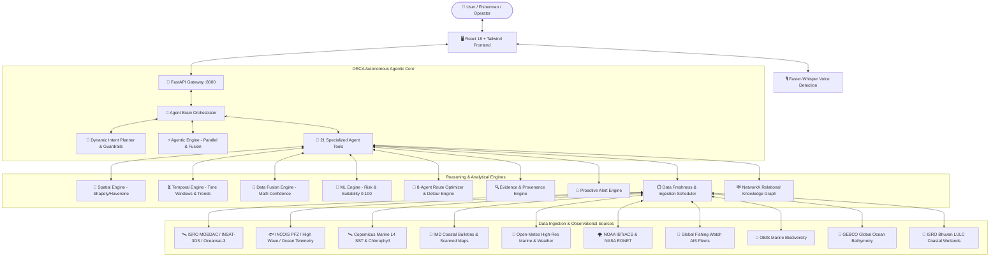

# 🌊 ORCA (Ocean & Real-Time Coastal Analytics)

## Comprehensive Project Architecture, Current Implementation Status & SIH 2026 Roadmap

> **Platform Overview:**  
> **ORCA** is an **Autonomous Agentic AI-Powered Marine Intelligence & Conversational Decision-Support Platform**. It unites multi-satellite Earth Observation (EO) data from **ISRO MOSDAC, INCOIS, Copernicus, NOAA, NASA, and GEBCO** with collaborative AI agents, spatial-temporal reasoning engines, and interactive GIS mapping to provide explainable, safety-critical decision support for fishermen, maritime operators, coastal authorities, and researchers.

---

## 📑 Table of Contents

1. [Executive Summary & Problem Statement Alignment](#1-executive-summary--problem-statement-alignment)
2. [Master Architecture & System Flow](#2-master-architecture--system-flow)
3. [Component-by-Component Analysis of Implemented Files](#3-component-by-component-analysis-of-implemented-files)
   - [3.1 Backend Gateway & API Layer](#31-backend-gateway--api-layer)
   - [3.2 Autonomous Agent Brain & Orchestration](#32-autonomous-agent-brain--orchestration)
   - [3.3 Core Reasoning & Analytical Engines (Phase B1–B10)](#33-core-reasoning--analytical-engines-phase-b1b10)
   - [3.4 Specialized Tool Suite (21 Autonomous Tools)](#34-specialized-tool-suite-21-autonomous-tools)
   - [3.5 Multi-Source Data Ingestion Fetchers](#35-multi-source-data-ingestion-fetchers)
   - [3.6 Data Repositories & GIS Assets](#36-data-repositories--gis-assets)
   - [3.7 Frontend Architecture & User Experience](#37-frontend-architecture--user-experience)
4. [Coverage of Canonical SIH Queries](#4-coverage-of-canonical-sih-queries)
5. [Current Verification & Test Suite Status](#5-current-verification--test-suite-status)
6. [Gap Analysis & Lacking Features (Upcoming Milestones)](#6-gap-analysis--lacking-features-upcoming-milestones)
7. [Hackathon Winning "Jury Wow" Features & Strategic Differentiators](#7-hackathon-winning-jury-wow-features--strategic-differentiators)
8. [Action Plan & Execution Checklist](#8-action-plan--execution-checklist)

---

## 1. Executive Summary & Problem Statement Alignment

### Problem Statement Requirements vs. ORCA Solutions

| SIH Requirement                                    | ORCA Architectural Implementation                                                                                                                                                                      | Status                  |
| :------------------------------------------------- | :----------------------------------------------------------------------------------------------------------------------------------------------------------------------------------------------------- | :---------------------- |
| **Natural Language Marine Interaction**            | Multi-turn conversational interface powered by LangChain + Ollama/Groq/OpenRouter with dynamic context injection (GPS coordinates, vessel classification, user ID).                                    | ✅ **100% Implemented** |
| **Autonomous Planning & Tool Selection**           | `intent_router.py` Dynamic LLM Planner decomposing user intent into execution plans with deterministic guardrails.                                                                                     | ✅ **100% Implemented** |
| **Multi-Agent Collaboration**                      | Multi-agent parallel execution (`agentic_engine.py`) and 8-agent Route Clearance system (`route_engine.py`).                                                                                           | ✅ **100% Implemented** |
| **Earth Observation Data Integration**             | Ingestion pipelines for ISRO MOSDAC (INSAT-3D/3DR/3DS, Oceansat-3, SCATSAT), Copernicus Sentinel-3 L4, INCOIS PFZ, NOAA IBTrACS, NASA EONET, GEBCO bathymetry, GFW AIS, and Bhuvan LULC.               | ✅ **100% Implemented** |
| **Spatial-Temporal Reasoning**                     | `spatial_engine.py` (Shapely GIS geometry, polygon clipping, haversine, compass bearings) and `temporal_engine.py` (future time window forecasting, trend detection, trip departure vs return safety). | ✅ **100% Implemented** |
| **Mathematical Data Fusion & Conflict Resolution** | `data_fusion_engine.py` fusing SST, chlorophyll, waves, and winds across overlapping sensors with mathematical confidence scores and safety overrides.                                                 | ✅ **100% Implemented** |
| **Marine Safety & Geofencing**                     | Dynamic vessel safety evaluation (small craft, trawler, cargo, research) against waves/swell/winds + UNCLOS 1982 maritime boundary hierarchy (Territorial, Contiguous, EEZ, High Seas, IMBL).          | ✅ **100% Implemented** |
| **Multilingual Coastal Support**                   | Faster-Whisper on-device acoustic voice auto-detection + UI translations across 10 Indian coastal languages (Tamil, Telugu, Malayalam, Kannada, Hindi, Bengali, Gujarati, Odia, Marathi, English).     | ✅ **100% Implemented** |
| **Explainable Recommendations**                    | `evidence_engine.py` emitting structured sensor provenance, observation timestamps, quality tags, and transparent decision rationales.                                                                 | ✅ **100% Implemented** |

---

## 2. Master Architecture & System Flow

---

## 3. Component-by-Component Analysis of Implemented Files

### 3.1 Backend Gateway & API Layer

- **[`backend/app/main.py`](file:///E:/sih/backend/app/main.py)** (1,314 lines)
  - Acts as the central FastAPI gateway with comprehensive CORS policies and asynchronous lifespan management.
  - **Core Endpoints:**
    - `POST /api/chat`: Primary conversational AI endpoint routing queries into `agent_brain.py`.
    - `POST /api/voice/transcribe`: Ingests audio blobs from browser microphone, passing them to Faster-Whisper to transcribe and automatically detect spoken language.
    - `GET /api/intel`: Master aggregator endpoint delivering full telemetry (safety, weather, PFZ, geofence, tides, ports, hazards) for any GPS coordinates.
    - `GET /api/safety`: Live wave, swell, wind, and squall safety verdict (SAFE / CAUTION / DO_NOT_VENTURE).
    - `GET /api/pfz`: Nearest Potential Fishing Zone coordinates, sector, bearing, and distance.
    - `GET /api/ocean`: Multi-source SST and chlorophyll telemetry comparing Copernicus vs ISRO vs NOAA.
    - `GET /api/geofence`: Distance to coast, UNCLOS zone classification, IMBL boundary proximity, and Marine Protected Area (WDPA) intersection.
    - `GET /api/tides`: High and low tide forecasts and harmonic water levels.
    - `GET /api/ports`: Indian ports and harbours with distance, bearing, and depth.
    - `GET /api/location/nearest`: Auto-snapping beacon returning nearest port and nearest active PFZ plume for any point clicked on map.
    - `GET /api/route` & `POST /api/route`: Safe sea routing with 8-agent clearance, under-keel clearance, and shelter harbours.
    - `GET /api/hazards`: Real-time cyclone tracks and live lightning strike layers.
    - `GET /api/productivity`: FAO catch trend analysis and OBIS species biodiversity.
    - `GET /api/bhuvan/ecology`: ISRO Bhuvan LULC 50K coastal wetland, forest, and mangrove coverage data.
    - `GET /api/graph`: Dynamic NetworkX knowledge graph mapping relationships between vessels, ports, hazards, and PFZs.
    - `GET /api/vessels`: Global Fishing Watch commercial fishing vessel AIS detections.
    - `GET /api/seasonal-ban`: State-wise statutory annual monsoon conservation fishing ban status.
    - `GET /api/alerts`: Real-time synthesized tactical alerts aggregating IMD warnings, wave alerts, geofence status, and bans.
    - `GET /api/alerts/bulletins`: Official IMD coastal weather warning bulletins with vision-transcribed synoptic summaries and linked scanned synoptic charts.
    - `POST /api/subscribe` & `GET /api/subscriptions`: Custom alert subscriptions (e.g. wave height > 2.0m).
    - `POST /api/what-if`: Future departure simulation ("What if I leave at 8 AM?").
    - `GET /api/layer/{layer_name}`: Fast GeoJSON layer server streaming 21 maritime GIS layers (EEZ, Territorial Waters, MPAs, Ramsar wetlands, Coral reefs, AIS vessels, Lightning, etc.).
    - `GET /api/system-health` & `POST /api/sync`: Real-time data freshness monitoring and on-demand cache refresh.

---

### 3.2 Autonomous Agent Brain & Orchestration

- **[`backend/app/agent_brain.py`](file:///E:/sih/backend/app/agent_brain.py)** (1,847 lines)
  - The central multi-agent cognitive architecture.
  - **Dynamic Planner Integration (Phase B1):** Calls `engine.intent_router.plan_tools()` using raw user queries to isolate intent, decompose sub-tasks, and restrict execution to relevant tools.
  - **Parallel Tool Execution:** Dispatches multiple independent tool calls simultaneously via `ThreadPoolExecutor`.
  - **Deterministic Safety Overrides:** Scans all tool outputs for hazardous conditions (e.g., squalls, high waves, cyclone alerts). If detected, automatically injects a high-priority system directive forcing the final verdict to **DANGEROUS 🚫**.
  - **Deterministic Fusion Engine:** Aggregates multi-source tool responses, calculates statistical agreement across SST/chlorophyll/wave metrics, determines mathematical confidence percentages (0–98%), and resolves conflicts.
  - **Context-Aware Vessel Profiling (56F):** Modifies safety thresholds according to craft specification (Small Non-Mechanized Craft, Mechanized Trawler, Cargo Vessel, Research Vessel).
  - **What-If Scenario Simulation (56G):** Evaluates multi-hour forward forecasts for requested departure hours.
  - **Context-Preserving Large-Output Stripper (`_strip_for_llm`):** Recursively prunes massive GeoJSON features and time-series arrays before passing to the 7B LLM context window while preserving full data payloads for the frontend map and charts.

---

### 3.3 Core Reasoning & Analytical Engines (Phase B1–B10)

Located in [`backend/app/engine/`](file:///E:/sih/backend/app/engine/):

1. **[`agentic_engine.py`](file:///E:/sih/backend/app/engine/agentic_engine.py)** (Phase B1/B5)
   - `execute_parallel()`: ThreadPool parallel execution preserving task ordering.
   - `compute_fusion()`: Multi-tool verdict resolution (safety-first logic), source deduplication, numeric spread verification, and mathematical confidence estimation.
   - `decompose_query()`: Splits complex conjunct queries ("and then", "after that") into discrete sub-intents.
   - `detect_workflow()`: Identifies deterministic multi-step procedures (such as `route_to_pfz`: PFZ Identification → Route Generation → Hazard Cross-Check).

2. **[`intent_router.py`](file:///E:/sih/backend/app/engine/intent_router.py)** (Phase B1)
   - Dynamic Autonomous LLM Planner backed by fast inference models (Groq LLaMA-3.1-8B, OpenRouter, or Ollama Qwen 2.5 7B).
   - Enforces deterministic Unicode-based language detection and tool execution limits.

3. **[`spatial_engine.py`](file:///E:/sih/backend/app/engine/spatial_engine.py)** (Phase B2)
   - Employs Shapely geometry for point-in-polygon checks across EEZ, MPA, Ramsar, and restricted zones.
   - Computes haversine geodesic distances, compass bearings (16-point windrose), and line-string route intersections.

4. **[`temporal_engine.py`](file:///E:/sih/backend/app/engine/temporal_engine.py)** (Phase B2)
   - Resolves natural language time references ("tomorrow morning", "in 6 hours", "this evening").
   - Extracts point-in-time marine forecasts, detects temporal trends (improving vs. deteriorating sea states), and evaluates round-trip departure vs. return voyage windows.

5. **[`data_fusion_engine.py`](file:///E:/sih/backend/app/engine/data_fusion_engine.py)** (Phase B3)
   - Mathematical cross-sensor fusion for overlapping SST (Copernicus L4 + ISRO INSAT-3DS + Open-Meteo), Chlorophyll (Copernicus + ISRO Oceansat-3), Waves, and Wind.
   - Flags sensor disagreements (e.g. SST delta > 2°C) and weights fresh observations over older data.

6. **[`ml_engine.py`](file:///E:/sih/backend/app/engine/ml_engine.py)** (Phase B4)
   - **Marine Risk Model:** Classifies risk into LOW, MODERATE, HIGH, or EXTREME based on vessel-specific tolerance limits.
   - **Fishing Suitability Model:** Produces a 0–100 suitability score combining chlorophyll concentration, SST thermal gradients, bathymetric depth, and 12-month breeding/monsoon seasonal weights.
   - **Statistical Anomaly Detection:** Flags standard deviation outliers in SST, chlorophyll, wave height, and wind speeds.

7. **[`route_engine.py`](file:///E:/sih/backend/app/engine/route_engine.py)** (Phase B6)
   - **8-Agent Collaborative Route Clearance Engine:** Evaluates navigation tracks against:
     1. Metocean & Sea State Agent (Waves/Wind/Gusts)
     2. Cyclone & Tropical Storm Agent (IBTrACS/EONET)
     3. Live Lightning & Convective Thunderstorm Agent (CAPE & Strike proximity)
     4. Geofence & Sovereign Security Agent (UNCLOS 12nm/24nm/EEZ/IMBL)
     5. GEBCO Bathymetry & Under-Keel Clearance Agent (Grounding & Shoal prevention)
     6. Marine Ecology & Coral Reef Agent (MPAs & Eco-standoffs)
     7. Statutory Seasonal Fishing Ban Agent (Annual monsoon conservation)
     8. ISRO Surface Currents & Drift Agent (Speed-over-ground adjustment)
   - Computes **Fastest, Safest, and Balanced routes**, detours around hazards, finds nearest emergency shelter ports, and generates GeoJSON waypoints.

8. **[`language_engine.py`](file:///E:/sih/backend/app/engine/language_engine.py)** (Phase B7)
   - Regex-based Unicode detection covering 10 Indian coastal languages.
   - Formulates localized response directives to ensure the LLM answers in the identical dialect.

9. **[`alert_engine.py`](file:///E:/sih/backend/app/engine/alert_engine.py)** (Phase B8)
   - Evaluates user subscriptions (`alert_subscriptions.json`) against live marine observation feeds.
   - Generates persistent alerts with severity classification (critical / warning / advisory).

10. **[`evidence_engine.py`](file:///E:/sih/backend/app/engine/evidence_engine.py)** (Phase B9)
    - Constructs transparent decision provenance blocks detailing data sources, observed values, observation timestamps, quality metrics, and reasoning summaries.

11. **[`freshness_engine.py`](file:///E:/sih/backend/app/engine/freshness_engine.py)** & **[`ingestion_scheduler.py`](file:///E:/sih/backend/app/engine/ingestion_scheduler.py)** (Phase B10)
    - Autonomous background daemon executing scheduled hourly fetch cycles across satellite and meteorological feeds.
    - Audits disk cache footprint, logs execution latency, and provides on-demand sync triggers (`/api/sync`).

12. **[`voice_service.py`](file:///E:/sih/backend/app/engine/voice_service.py)**
    - Uses Faster-Whisper (CPU int8 quantized) with automatic 99-language acoustic identification, enabling seamless local language audio transcription without requiring manual language selection.

---

### 3.4 Specialized Tool Suite (21 Autonomous Tools)

Located in [`backend/app/tools/`](file:///E:/sih/backend/app/tools/):

1. `safety_tool.py`: Evaluates waves, winds, squall warnings, and small craft thresholds.
2. `pfz_tool.py`: Maps INCOIS 12-sector Potential Fishing Zones, oceanic fronts, and Bhuvan coastal context.
3. `geofence_tool.py`: Verifies maritime borders, MPA polygons, Ramsar wetlands, and IMBL standoff lines.
4. `tide_tool.py`: Computes harmonic tide predictions and water level height variations.
5. `hazard_tool.py`: Integrates cyclone risk, historical storm trajectories, and convective storm indices.
6. `lightning_layer.py`: Synthesizes live convective thunderstorm points and CAPE risk polygons.
7. `navigation_tool.py`: Queries GEBCO bathymetry, nearest ports/harbours, and ISRO surface currents.
8. `productivity_tool.py`: Analyzes FAO commercial catch historical trends and OBIS marine biodiversity.
9. `alerts_tool.py`: Dispatches localized IMD coastal bulletins and squall advisories.
10. `knowledge_graph_tool.py`: Generates NetworkX relational graphs for spatial-relational queries.
11. `spatial_temporal_tool.py`: Executes composite spatial-temporal forecasts and departure/return voyage assessments.
12. `ml_risk_tool.py`: Wraps the machine learning risk and fishing suitability indices.
13. `fusion_tool.py`: Wraps multi-source sensor fusion algorithms.
14. `route_optimizer_tool.py`: Wraps the 8-agent route clearance orchestrator.
15. `global_validation_tool.py`: Cross-checks Copernicus against NOAA OISST and NASA MODIS.
16. `ocean_agent`, `geospatial_agent`, `tide_agent`, `hazard_agent`, `navigation_agent`, `what_if_departure_agent`: Exposed LangChain tool wrappers in `agent_brain.py`.

---

### 3.5 Multi-Source Data Ingestion Fetchers

Located in [`backend/fetchers/`](file:///E:/sih/backend/fetchers/):

- `fetch_copernicus_satellite.py`: Fetches Sentinel-3 L4 Sea Surface Temperature & Chlorophyll products.
- `fetch_cyclone_track.py`: Integrates NOAA IBTrACS historical/active cyclone tracks, NASA EONET events, and IMD Cyclone bulletins.
- `fetch_gfw.py`: Integrates Global Fishing Watch AIS commercial fishing vessels, fleet composition, and IUU activity events.
- `fetch_global_sources.py`: Pulls NOAA Coral Reef Watch bleaching alerts, NASA MODIS chlorophyll, and EMODnet bathymetry.
- `fetch_imd_alerts.py`: Fetches official IMD coastal weather warning PDFs, converts pages to images, and extracts vision synoptic transcripts.
- `fetch_incois_pfz.py`: Ingests INCOIS Potential Fishing Zone advisories across all Indian maritime sectors.
- `fetch_isro_mosdac.py`: Ingests ISRO MOSDAC INSAT-3D/3DR/3DS, EOS-06 SCATSAT-1, and Oceansat datasets.
- `fetch_obis_biodiversity.py`: Queries Ocean Biodiversity Information System for marine species distribution data.
- `fetch_openmeteo_marine.py`: Pulls high-resolution global marine forecasts (waves, swell, periods, directions, wind, gusts, CAPE).
- `fetch_seasonal_ban.py`: Ingests annual statutory monsoon conservation fishing ban calendars for East and West coasts.
- `fetch_tides.py`: Ingests Survey of India (SOI) tide gauge predictions.
- `generate_pfz_from_copernicus.py`: Synthesizes thermal and chlorophyll front convergences directly from satellite rasters.

---

### 3.6 Data Repositories & GIS Assets

Located in [`data/`](file:///E:/sih/data/):

- **`data/static/marine_regions/`**: India EEZ (200nm), 12nm Territorial Waters, 24nm Contiguous Zone, Internal Waters, High Seas, and IHO Indian Ocean basin boundaries.
- **`data/static/wdpa/`**: World Database on Protected Areas (WDPA) covering Indian Marine Protected Areas (MPAs), Ramsar wetland sites, and ecologically sensitive coastal sanctuaries.
- **`data/static/cyclones/`**: Official 150-year North Indian Ocean cyclone tracks from NOAA IBTrACS and IMD.
- **`data/static/osm/`**: Complete Indian coastal ports, fishing harbours, lighthouses, and fish landing centers.
- **`data/static/gfw/`**: Commercial fishing vessel AIS position detections and trawling events.
- **`data/static/openseamap/`**: Nautical marks, buoys, beacons, and navigational aids.
- **`data/static/ecology/`**: OBIS marine species occurrences and living coral reef distributions (Gulf of Mannar, Lakshadweep, Andaman).
- **`data/static/fishban/`**: Official Ministry of Fisheries annual seasonal fishing ban calendar.
- **`data/static/fao/`**: FAO Major Fishing Area 51 & 57 regional catch statistics.
- **`data/gebco_2026_*.tif`**: 181 MB high-resolution GEBCO ocean bathymetry grid covering the Indian Ocean.
- **`data/live_cache/`**: Active operational caches for alerts, live lightning layers, tides, waves, weather, SST, and sync audit logs.

---

### 3.7 Frontend Architecture & User Experience

Built with **React 18 + Vite + Tailwind CSS + Lucide Icons + Leaflet GIS + TanStack React Query**.

#### 12 Dedicated Application Pages:

1. **[`HomeDashboard.jsx`](file:///E:/sih/frontend/src/pages/HomeDashboard.jsx)**: Central mission dashboard featuring live telemetry tiles, safety gauges, marine status overview, quick scenario triggers, and interactive mini-map preview.
2. **[`AskPage.jsx`](file:///E:/sih/frontend/src/pages/AskPage.jsx)**: Conversational Agentic AI Assistant featuring multi-turn memory, Faster-Whisper microphone input, map pin dropping, real-time agent execution visualizer, structured evidence cards, and departure time simulation.
3. **[`OceanExplorer.jsx`](file:///E:/sih/frontend/src/pages/OceanExplorer.jsx)**: Full-screen interactive GIS mapping terminal with 12 layer toggles (EEZ, Territorial, MPAs, Ramsar, PFZ, AIS vessels, Bathymetry, Ports, Cyclones, Lightning), coordinate inspection, distance measurement tools, and auto-snapping maritime beacons.
4. **[`SafetyAdvisoryPage.jsx`](file:///E:/sih/frontend/src/pages/SafetyAdvisoryPage.jsx)**: Real-time safety gauge (SAFE / CAUTION / DO_NOT_VENTURE), vessel profile selector, 24-hour wave/swell forecast charts, IMD squall warning bulletins, and downloadable official Safety Departure Clearance Certificates.
5. **[`RoutePlannerPage.jsx`](file:///E:/sih/frontend/src/pages/RoutePlannerPage.jsx)**: Autonomous Route Planner & 8-Agent Clearance Engine. Compares Fastest, Safest, and Balanced routes, displays multi-agent vetting status, lists under-keel clearance soundings, explains detour rationales, and marks emergency refuge ports.
6. **[`FisheriesIntelligencePage.jsx`](file:///E:/sih/frontend/src/pages/FisheriesIntelligencePage.jsx)**: Potential Fishing Zone advisory card, distance/bearing to nearest oceanic plume, water depth in fathoms, target commercial pelagic fish species guides, and FAO decadal productivity trends.
7. **[`EcologyPage.jsx`](file:///E:/sih/frontend/src/pages/EcologyPage.jsx)**: Coastal ecological intelligence displaying ISRO Bhuvan LULC mangrove and wetland distributions, living coral reef coordinates, OBIS biodiversity records, and MPA conservation standoffs.
8. **[`GeofencingPage.jsx`](file:///E:/sih/frontend/src/pages/GeofencingPage.jsx)**: UNCLOS statutory zone hierarchy viewer, IMBL proximity monitor, restricted naval zones, and interactive border breach simulator.
9. **[`AlertsPage.jsx`](file:///E:/sih/frontend/src/pages/AlertsPage.jsx)**: Tactical alerts feed, official IMD scanned weather warning bulletins with OCR transcripts, and user alert condition subscription manager.
10. **[`ReportsPage.jsx`](file:///E:/sih/frontend/src/pages/ReportsPage.jsx)**: Exportable formal marine intelligence reports (Vessel Departure Briefs, Fisheries Bulletins, Environmental Compliance Reports).
11. **[`DataSourcesPage.jsx`](file:///E:/sih/frontend/src/pages/DataSourcesPage.jsx)**: Transparency and health dashboard tracking data ingestion status, observation timestamps, cache freshness, and on-demand sync button.
12. **[`AboutPage.jsx`](file:///E:/sih/frontend/src/pages/AboutPage.jsx)**: Platform mission, problem statement mapping, and multi-agent system architecture documentation.

#### Key Specialized Components:

- **`CommandBar.jsx`**: Universal Spotlight command palette accessible across the entire application for instant queries and tool execution.
- **`MultiAgentRouteClearanceCard.jsx`**: Visual breakdown of the 8 collaborative maritime agents voting on route safety.
- **`MapCanvas.jsx` & `RouteMapCanvas.jsx`**: High-performance Leaflet-based GIS canvas with customized layer styling, clustering, and interactive popups.
- **`translations.js`**: 960+ lines of localized phrases across 10 Indian coastal languages.

---

## 4. Coverage of Canonical SIH Queries

| Canonical Problem Statement Query                                                                          | ORCA Handling Component & Methodology                                                                                                                                                    | Response Modality                                                                            |
| :--------------------------------------------------------------------------------------------------------- | :--------------------------------------------------------------------------------------------------------------------------------------------------------------------------------------- | :------------------------------------------------------------------------------------------- |
| **"Where is the nearest Potential Fishing Zone (PFZ) today?"**                                             | `pfz_tool.py` + `fetch_incois_pfz.py` computes geodesic distance and compass bearing to the nearest INCOIS oceanic front, reporting water depth in fathoms and target schooling species. | Conversational summary, distance/bearing metric, interactive map beacon, and depth profile.  |
| **"Is it safe to venture into the sea tomorrow morning?"**                                                 | `safety_tool.py` + `temporal_engine.py` extracts tomorrow morning's wave, swell, and wind forecast, applies vessel profile constraints, and issues a deterministic safety verdict.       | Clear SAFE / CAUTION / DO NOT VENTURE badge, risk factor list, and 24h forecast graph.       |
| **"What are the tide, weather, and sea conditions near my fishing location?"**                             | `tide_tool.py` + `safety_tool.py` + `openmeteo_marine` fetches harmonic high/low tides, wave height, swell period, wind speed, gusts, and precipitation.                                 | Time-series chart of tide levels and hourly wave heights with numerical telemetry.           |
| **"Are there any lightning or cyclone alerts in my area?"**                                                | `hazard_tool.py` + `lightning_layer.py` + `alerts_tool.py` queries NOAA IBTrACS storm corridors, convective CAPE indices, and official IMD squall warnings within user radius.           | Severe weather alert cards, distance to storm center, and live lightning strike map overlay. |
| **"Which regions show high chlorophyll concentration and favourable sea surface temperature?"**            | `pfz_tool.py` + `fetch_copernicus_satellite.py` + `fetch_isro_mosdac.py` detects thermal gradients and chlorophyll-a blooms, cross-checking Copernicus vs ISRO.                          | Chlorophyll and SST front metrics, sensor agreement rating, and ocean layer map toggle.      |
| **"What is the safest route for a fishing vessel considering weather and sea-state conditions?"**          | `route_engine.py` runs 8-agent collaborative clearance comparing Fastest vs Safest vs Balanced sea routes, detouring around shallow shoals, storms, and restricted waters.               | Multi-route comparison card, step-by-step waypoints, clearance badge, and refuge ports.      |
| **"Why has fish productivity declined in a particular coastal region?"**                                   | `productivity_tool.py` + `fetch_bhuvan_ecology` correlates decadal FAO catch statistics, OBIS species diversity, and Bhuvan LULC coastal mangrove/wetland reduction.                     | Analytical historical explanation, FAO trend graph, and coastal habitat degradation context. |
| **"Which fishing zones should be avoided due to hazardous marine conditions or geofencing restrictions?"** | `geofence_tool.py` + `fetch_seasonal_ban.py` identifies UNCLOS boundaries, IMBL proximity, MPAs, coral reefs, and active statutory monsoon fishing bans.                                 | Avoidance zone polygons on map, statutory ban notice, and international border distance.     |

---

## 5. Current Verification & Test Suite Status

The project includes an automated test harness in [`backend/app/test_master_suite.py`](file:///E:/sih/backend/app/test_master_suite.py):

- **15 Comprehensive Test Scenarios** covering:
  1. Fisherman Safety Dialogue (English)
  2. Multilingual Query Dialogue (Tamil)
  3. Multi-Turn Context Memory
  4. Full Dashboard Intel Aggregator (`/api/intel`)
  5. Safety & Weather Telemetry (`/api/safety`)
  6. Potential Fishing Zones (`/api/pfz`)
  7. Multi-Source Satellite Ocean Data (`/api/ocean`)
  8. Cyclone & Lightning Hazards (`/api/hazards`)
  9. Geofencing & Eco-Restrictions (`/api/geofence`)
  10. Harmonic Tide Predictions (`/api/tides`)
  11. Multi-Agent Route Optimization (`/api/route`)
  12. What-If Scenario Simulation (`/api/what-if`)
  13. Statutory Monsoon Fishing Ban (`/api/seasonal-ban`)
  14. Global Fishing Watch Vessel Detections (`/api/vessels`)
  15. NetworkX Relational Knowledge Graph (`/api/graph`)

---

## 6. Gap Analysis & Lacking Features (Upcoming Milestones)

While the core platform is fully functional, the following capabilities represent valuable additions to finalize the system:

| Domain                                              | Current Implementation                                                     | Lacking / Upcoming Feature                                                                                                                                                                                              | Impact    |
| :-------------------------------------------------- | :------------------------------------------------------------------------- | :---------------------------------------------------------------------------------------------------------------------------------------------------------------------------------------------------------------------- | :-------- |
| **Offline Marine Operation**                        | Web application requires internet connectivity; has fallback local caches. | **Progressive Web App (PWA) & Offline Mode:** Service Workers and IndexedDB caching allowing fishermen at sea (beyond 4G/5G range) to access cached nautical charts, offline emergency procedures, and GPS coordinates. | High      |
| **Voice Output (Speech-to-Text vs Text-to-Speech)** | Voice input with Faster-Whisper auto-detects 10 Indian languages.          | **Text-to-Speech (TTS) Voice Responses:** Local language speech synthesis (using Bhashini / Indic-TTS / Web Speech API) to speak advisories out loud for illiterate or visually impaired fishermen.                     | Very High |
| **Low-Bandwidth SMS / WhatsApp Gateway**            | In-app alert notification center with custom trigger subscriptions.        | **Automated SMS / WhatsApp Push Notifications:** Twilio / Gupshup webhook delivering tactical squall and PFZ coordinates directly to basic feature phones via SMS.                                                      | High      |
| **Live AIS WebSocket Streaming**                    | Static GFW AIS fishing vessel GeoJSON with periodic polling and caching.   | **Live Real-time AIS WebSocket Stream:** Real-time vessel movement visualization with heading vectors and collision risk calculation (CPA/TCPA).                                                                        | Medium    |
| **3D Seafloor Bathymetry Visualization**            | 2D GEBCO bathymetric depth soundings and under-keel clearance calculation. | **3D Ocean Bathymetry View:** WebGL / Three.js / Deck.gl 3D elevation map rendering underwater trenches, seamounts, and continental shelves.                                                                            | Medium    |
| **SOS Emergency Distress Beacon**                   | Proactive warning badges and shelter port recommendations.                 | **One-Click SOS Distress Relay:** Broadcasts GPS coordinates, vessel registration, and emergency telemetry to Indian Coast Guard and nearby AIS vessels.                                                                | High      |

---

## 7. Hackathon Winning "Jury Wow" Features & Strategic Differentiators

To stand out in the SIH Grand Finale and demonstrate market-ready innovation, ORCA incorporates several unique differentiators:

### 🌟 1. "Eight-Agent Route Clearance Certificate"

Instead of merely calculating a shortest route, ORCA runs an **8-agent maritime jury**:

- Metocean Agent, Cyclone Agent, Lightning Agent, UNCLOS Geofence Agent, GEBCO Bathymetry Agent, Marine Ecology Agent, Seasonal Ban Agent, and ISRO Current Drift Agent.
- Each agent explicitly votes: **PASSED**, **WARNING (Detour Recommended)**, or **CRITICAL BLOCKER (Hold Departure)**.
- Generates an official, printable **Maritime Departure Clearance Certificate** complete with digital verification hash, risk score, and designated shelter ports.

### 🌟 2. Official IMD Weather Warning Scans & OCR Transcripts

- Downloads the actual daily coastal weather warning bulletins directly from the IMD Cyclone Warning Division.
- Employs vision processing to extract structured synoptic situations and links the official scanned regional forecast chart directly in the UI.

### 🌟 3. Acoustic On-Device Voice Auto-Detection (Faster-Whisper)

- Fishermen do not need to choose their language from a dropdown.
- They press the microphone and speak in **Tamil, Malayalam, Telugu, Hindi, or English**; Faster-Whisper automatically classifies the acoustic spectrogram and responds in the identical language.

### 🌟 4. Mathematical Data Fusion (Copernicus + ISRO + NOAA)

- Replaces vague LLM guesses with verifiable mathematical confidence scores (0–98%).
- Explains exact temperature and chlorophyll spreads between satellite constellations.
- Implements a strict **Safety-First Override**: if any single satellite or weather feed detects squalls or rough seas, the system automatically mandates a **CAUTION** or **DO NOT VENTURE** verdict.

### 🌟 5. Dynamic "What-If" Scenario Simulator

- Empowers skippers to simulate operational departures: _"What if I depart at 08:00 instead of 05:00?"_
- Computes forward metocean vectors and highlights safer departure windows where wind gusts and wave crests decrease.

### 🌟 6. Interactive NetworkX Maritime Knowledge Graph

- Visualizes relationships between coastal entities: Vessel $\leftrightarrow$ Port $\leftrightarrow$ Hazard $\leftrightarrow$ PFZ $\leftrightarrow$ Marine Protected Area $\leftrightarrow$ International Maritime Boundary Line.

---

## 8. Action Plan & Execution Checklist

### Immediate Next Steps for Hackathon Readiness:

- [x] Analyze all files, engines, tools, fetchers, static data, and frontend components.
- [x] Map implementation against all 8 canonical queries of the SIH Problem Statement.
- [x] Generate comprehensive `project_status.md` documentation.
- [ ] Implement browser **Web Speech API / TTS engine** to enable spoken audio playback of agent responses in Indian languages.
- [ ] Add Service Worker manifest to enable **PWA offline caching** for critical nautical layers and emergency advisories.
- [ ] Add simulated SMS/WhatsApp dispatch modal in the Alerts tab to demonstrate automated alerts to non-smartphone feature phones.
- [ ] Prepare a 5-minute Grand Finale presentation slide deck and rehearsed live demonstration sequence.

---

_Report generated automatically for the **ORCA Maritime Agentic AI Platform** (SIH 2026)._
